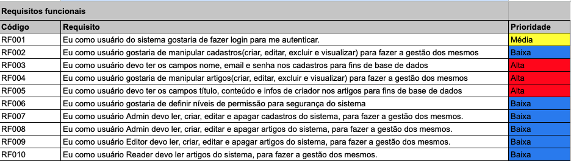
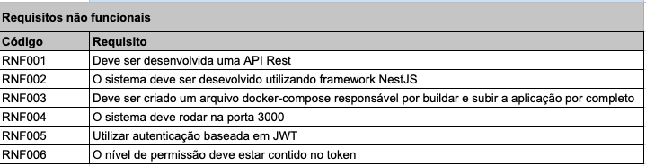
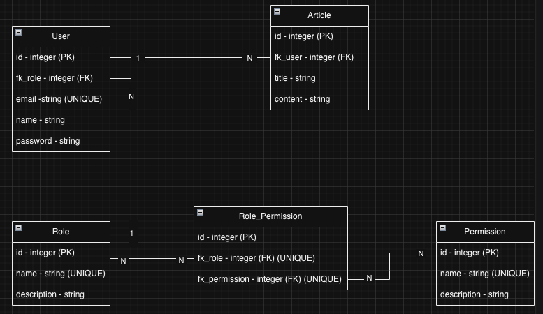

<p align="center">
  <a href="https://ramiro4dev.com.br/" target="blank"></a>
</p>

## Descrição

Projeto teste backend Squadra.
O desafio consiste em criar uma estrutura de rotas para manipulação de usuário e artigos.
Também é um requisito implementar o processo de autenticação e autorização do sistema.

O processo de desenvolvimento começou pelo levantamento e elicitação dos requisitos, seguido das definições técnicas de modelagem do banco de dados e design da arquitetura, após essas definições, iniciou-se o processo de codificação. Conforme pode ser observado pelo histórico de commits, iniciando com as configurações base do projeto, após, a implementação da modelagem definida no ER (schema, migrations e seeds), criação dos containers docker e desenvolvimento dos módulos, em ordem, foram desenvolvidos os modulos de usuários, artigos, authenticação e autorização. E por fim, a implementação dos testes.

Foi desenvolvida uma Api Rest, seguindo as boas práticas e padrões de mercado.
Utilizando uma arquitetura modular, padrão do nest, juntamente com autenticação por meio de token JWT, e uma autorização granular baseada em permissões.
Como base de dados, foi escolhido um banco relacional (Postgres), por entender que se encaixa melhor ao contexto do problema.
<br/><br/><br/>
<p align="center">
  
  
  
</p>
<br/><br/>

## Como rodar o projeto
<br/>

O único requisito para rodar o projeto é ter o docker instalado.

Na raiz do projeto, execute:

```bash
docker-compose up --build
```
<br/>

Nesse ponto as imagens necessárias para rodar o projeto serão baixadas e construídas conforme as configurações descritas nos arquivos docker.
Após ter as imagens construídas, entra o processo de up(subida) dos serviços. Por ordem, primeiramente o banco de dados e depois a aplicação.
Foi solicitado deixar o rodando, por isso no momento da subida são executados os comandos para criar a estrutura do banco de dados (migrations), e popular o banco com as seeds. Foi tomado o cuidado para que ao popular o banco tudo seja feito dentro de transações e com criação condicional, para que possa ser executadas inúmeras vezes a cada up do serviço. Processo ao qual não recomendaria para produção.

Após executar, o projeto estará rodando em: http://localhost:3000

<br/><br/>

## Documentação

```bash
/docs
```
Basta acesar o caminho descrito acima para ter acesso a documentação de api e o playground de testes via swagger, deixei habilitado em "produção" para facilitar os testes.

```bash
# Dados de teste:

User Admin	
email: admin@email.com
senha: admin123

User Editor	
email: editor@email.com
senha: editor123

User Reader	
email: reader@email.com
senha: reader123
```
<br/><br/>

## Desenvolvimento

Para executar o projeto em modo de desenvolvimento, basta subir o container do banco de dados, e após, na raiz do projeto executar:

```bash
$ yarn
$ yarn prisma:generate
$ yarn start:dev
```

também é possivel rodar as migrations e seeds, manualmente:
```bash
$ yarn
$ yarn prisma:dev:migration
$ yarn prisma:seed
```
<br/><br/>

## Executar os testes
O projeto conta com alguns testes unitários nos módulos de usuários e artigos.
No terminal, execute:

```bash
# unit tests
$ yarn run test
```

Para acompanhar a cobertura dos testes, execute:

```bash
# coverage
$ yarn run test:cov
```
<br/><br/>

## Contatos

- Author  -  R4mirou!
- Email   -  contato@ramiro4dev.com.br
- Website -  [https://ramiro4dev.com.br](https://ramiro4dev.com.br)
